# Kiriş — Türkiye Kamu Tasarım Sistemi

Türkiye'deki kamu hizmetleri için bileşen kütüphanesi, tasarım belirteçleri ve
uygulama rehberi. HTML/CSS çekirdeği, React ve Vue sarmalayıcıları içerir.

> **Bu proje bağımsız bir öneridir.** Resmî bir kamu hizmeti değildir.

## Belgeler

- [Bileşenler ve canlı örnekler](https://trds.chele.bi/bilesenler/)
- [Kurulum ve entegrasyonlar](https://trds.chele.bi/entegrasyonlar/)
- [Örnek kurum siteleri](https://trds.chele.bi/ornekler/)
- [llms.txt](llms.txt) ve [llms-full.txt](llms-full.txt): bir yapay zekâ yardımcısının bileşenleri doğru kullanması için tam başvuru. `node tools/llms.mjs` üretir, belge sitesi kökünde de durur.

## Hızlı başlangıç

```bash
git clone https://github.com/woosal1337/trds.git
cd kiris
npm ci
npm run yapi
npm test
npm run denetle
npm run sun
```

Node 22.14 veya üstünü kullanın. Çekirdek ve belge üreticisi yalnız Node standart
kütüphanesini kullanır. `npm ci`, React ve Vue testleri için bağımlılıkları kurar.
Yerel site: <http://localhost:4173>.

Bir projede kullanmak için:

```html
<link rel="stylesheet" href="kiris.min.css">
<script type="module" src="kiris.min.js"></script>
```

## Mimari

```
kiris/
├── tools/registry/          tek doğruluk kaynağı — her bileşenin tanımı
│   ├── 10-form.mjs          form ve eylem bileşenleri
│   ├── 20-yapi.mjs          yerleşim, gezinme, içerik, geri bildirim
│   ├── 30-turkiye.mjs       Türkiye'ye özgü bileşenler
│   ├── 40-ek.mjs            ikinci parti: girdi türleri, arama, gezinme, metin
│   └── 50-tamam.mjs         ek içerik, gezinme ve etkileşim bileşenleri
├── packages/
│   ├── tokens/              tasarım belirteçleri, DTCG biçiminde
│   ├── core/                HTML, CSS ve ilerlemeli iyileştirme katmanı
│   ├── validators/          Türkçe doğrulama ve biçimlendirme, testli
│   ├── tanim/               bileşen tanımları, çerçeveden bağımsız çizim işlevleri
│   ├── react/               React sarmalayıcıları, tanımlardan üretilir
│   ├── vue/                 Vue sarmalayıcıları, tanımlardan üretilir
│   └── themes/              marka renginden üretilen kurum temaları
└── apps/docs/               belge sitesi üreticisi ve sunucusu
```

**Kayıt defteri her şeyi besler.** Belge sitesi, bileşen dizini, entegrasyon
tablosu, WCAG haritası ve aşağıdaki tablo tek bir kaynaktan üretilir. Bir
bileşen hakkında hiçbir bilgi iki kez yazılmaz.

### Katman sırası

1. **Belirteçler** — renk, aralık, tipografi. Bir bileşen ham değer kullanmaz.
2. **Çekirdek** — HTML ve CSS. JavaScript olmadan da çalışır.
3. **Davranış** — `data-kiris` ile bağlanan ilerlemeli iyileştirme.
4. **Saramalar** — React ve diğerleri. Aynı HTML'i üretir, iş mantığı taşımaz.

Bu sıra bilerek seçildi. JavaScript çalışmazsa hizmet çalışmaya devam eder.

## Kontrast bir söz değil, bir denetimdir

`node packages/tokens/build.mjs` her çalıştığında 36 kontrast garantisi
yeniden hesaplanır. Bir garanti tutmazsa **yapı durur**.

```
belirteç: 161 · koyu fark: 43 · kontrast denetimi: 36
Bütün kontrast garantileri tutuyor.
```

Tema üreticisi de aynı kuralı uygular. Bir kurum tek bir marka rengi verir,
`packages/themes/build.mjs` ondan tam bir ölçek üretir ve ölçüt karşılanana
kadar renkleri koyulaştırır.

```
Sağlık (saglik) marka #0d7a5f
    metin / beyaz zemin: 5.29 (en az 4.5) gecti
    guclu / beyaz zemin: 7.23 (en az 7) gecti
```

## Türkiye'ye özgü olan ne

Aşağıdaki bileşenlerin kuralı, biçimi veya yasal dayanağı Türkiye'ye aittir.
Bunları hiçbir yabancı tasarım sisteminden kopyalayamazsınız.

<!-- OZGUN:BASLA -->
<!-- Bu blok üretilir. Elle değiştirmeyin: node tools/readme.mjs -->

| Bileşen | İngilizce | Neden Türkiye’ye özgü |
|---|---|---|
| **Adres** | Address | Türk adresi il, ilçe, mahalle, cadde veya sokak, bina no ve daire no olarak yapılır. |
| **e-Devlet ile giriş** | e-Devlet sign in | e-Devlet ile giriş seçeneğini tutarlı bir işaret ve etiketle gösterir. |
| **Erişilebilirlik menüsü** | Accessibility menu | Yazı boyutu ve tema tercihlerini tek menüde toplar. |
| **IBAN girişi** | IBAN input | IBAN hatası para kaybına yol açar. |
| **Kurum logosu** | Logo lockup | Kurumun işaretini ve adını aynı düzende gösterir. |
| **Kurum tanıtıcısı** | Identifier | Türkiye’de bir vatandaş bir hizmeti hangi kurumun yürüttüğünü çoğu zaman bilmez. |
| **KVKK açık rıza** | Data protection consent | Aydınlatma metni bağlantısını ve kullanıcının onay seçeneğini aynı alanda gösterir. |
| **Plaka girişi** | Licence plate input | Türkçe büyük harf kuralı burada gerçek bir hata kaynağıdır. |
| **Resmî site afişi** | Masthead | Resmî hizmetlerde kurum kimliğini ve alan adını kontrol etme yolunu gösterir. |
| **T.C. kimlik numarası girişi** | National identity number input | Kimlik numarasının hane sayısını ve sağlama toplamını denetler. |
| **Tarih girişi** | Date input | Biçim farkı gerçek bir hata kaynağıdır. |
| **Telefon girişi** | Phone input | Türk kullanıcı numarasını 0 ile yazar. |
| **Vergi kimlik numarası girişi** | Tax number input | Kurumsal hizmetlerin tamamı bu numarayı ister. |

<!-- OZGUN:BITIR -->

### Türkçe büyük harf kuralı bir süs değil

```js
'34 iz 1234'.toUpperCase()   // '34 IZ 1234'  — yanlış plaka sorgulanır
trBuyuk('34 iz 1234')        // '34 İZ 1234'  — doğru
```

`@kiris-ds/validators` paketi bu kuralı, T.C. kimlik numarası sağlamasını, vergi
kimlik numarası sağlamasını, IBAN mod 97 denetimini, telefon normalleştirmesini,
plaka biçimini ve Türkçe alfabe sıralamasını **36 test ile** kapsar.

## Bileşenler

<!-- BILESEN:BASLA -->
<!-- Bu blok üretilir. Elle değiştirmeyin: node tools/readme.mjs -->

Toplam **116 bileşen**, 10 grupta. 🇹🇷 işareti, o bileşenin kuralının veya yasal dayanağının Türkiye’ye ait olduğunu gösterir. Her görüntü, belge sitesindeki canlı örneğin kendisidir ve `node tools/bilesen-goruntu.mjs` ile yenilenir.

### Kimlik

Kullanıcıya bunun bir devlet hizmeti olduğunu söyleyen parçalar.

| Görünüm | Bileşen | CSS | JS | React | |
|---|---|---|---|---|---|
| 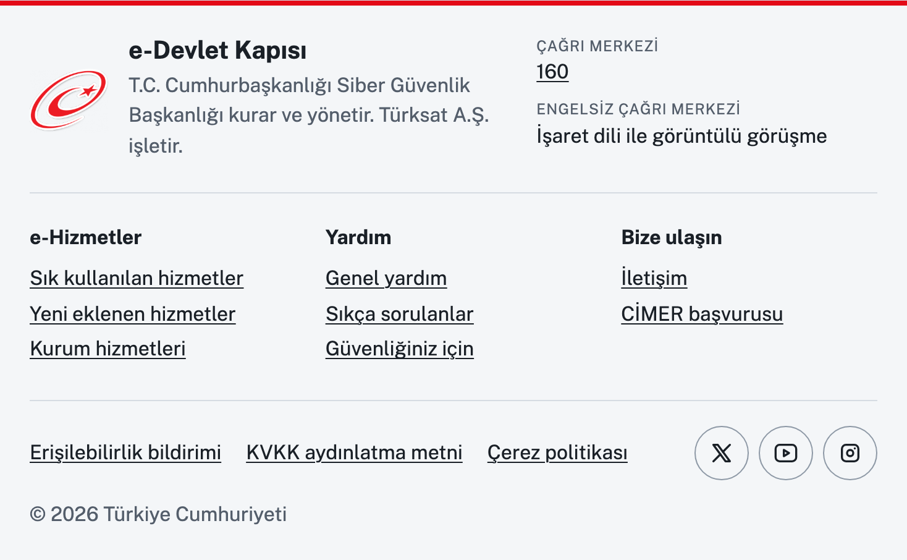 | **Alt bilgi**<br><sub>Footer</sub> | kararlı | — | kararlı | [Belge](https://trds.chele.bi/bilesenler/footer.html) |
|  | **Aşama afişi**<br><sub>Phase banner</sub> | kararlı | — | kararlı | [Belge](https://trds.chele.bi/bilesenler/phase-banner.html) |
| 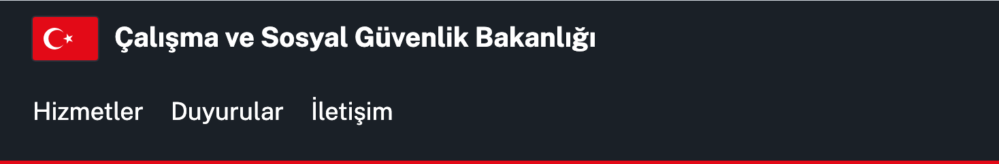 | **Başlık**<br><sub>Header</sub> | kararlı | mobil menü | kararlı | [Belge](https://trds.chele.bi/bilesenler/header.html) |
| 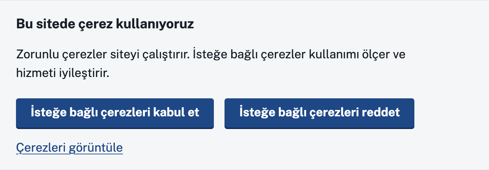 | **Çerez bildirimi**<br><sub>Cookie banner</sub> | kararlı | tercih saklama | kararlı | [Belge](https://trds.chele.bi/bilesenler/cookie-banner.html) |
| 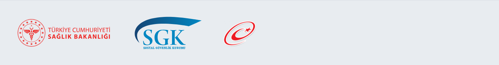 | 🇹🇷 **Kurum logosu**<br><sub>Logo lockup</sub> | kararlı | — | kararlı | [Belge](https://trds.chele.bi/bilesenler/logo.html) |
| 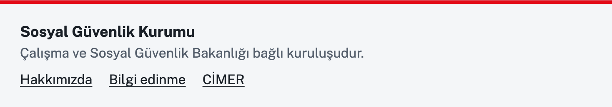 | 🇹🇷 **Kurum tanıtıcısı**<br><sub>Identifier</sub> | kararlı | — | kararlı | [Belge](https://trds.chele.bi/bilesenler/identifier.html) |
| 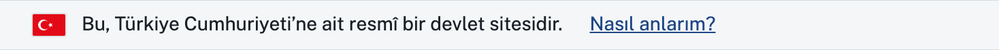 | 🇹🇷 **Resmî site afişi**<br><sub>Masthead</sub> | kararlı | aç ve kapat | kararlı | [Belge](https://trds.chele.bi/bilesenler/masthead.html) |
| 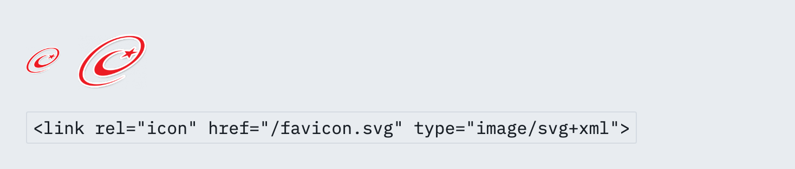 | **Sekme simgesi**<br><sub>Favicon</sub> | — | — | — | [Belge](https://trds.chele.bi/bilesenler/favicon.html) |

### Gezinme

Kullanıcının nerede olduğunu ve nereye gidebileceğini gösteren parçalar.

| Görünüm | Bileşen | CSS | JS | React | |
|---|---|---|---|---|---|
| 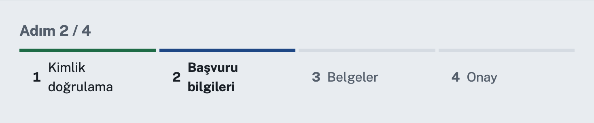 | **Adım göstergesi**<br><sub>Step indicator</sub> | kararlı | — | kararlı | [Belge](https://trds.chele.bi/bilesenler/step-indicator.html) |
| 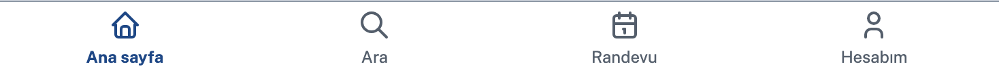 | **Alt gezinme**<br><sub>Bottom navigation</sub> | kararlı | — | kararlı | [Belge](https://trds.chele.bi/bilesenler/bottom-navigation.html) |
| 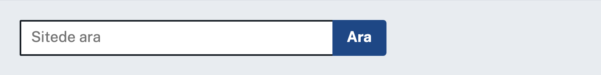 | **Arama**<br><sub>Search</sub> | kararlı | öneri listesi | kararlı | [Belge](https://trds.chele.bi/bilesenler/search.html) |
| 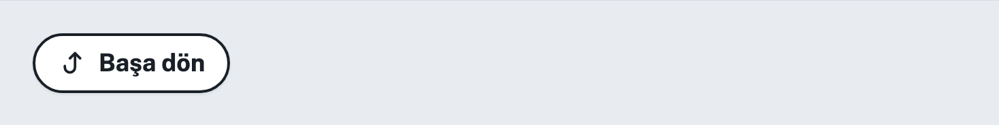 | **Başa dön**<br><sub>Back to top</sub> | kararlı | görünürlük | kararlı | [Belge](https://trds.chele.bi/bilesenler/back-to-top.html) |
| 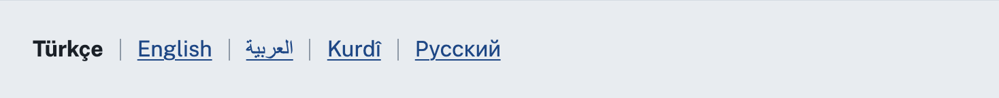 | **Dil seçici**<br><sub>Language selector</sub> | kararlı | — | kararlı | [Belge](https://trds.chele.bi/bilesenler/language-selector.html) |
| 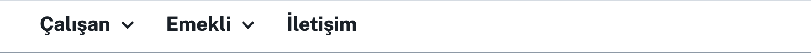 | **Geniş menü**<br><sub>Mega menu</sub> | kararlı | aç ve kapat | kararlı | [Belge](https://trds.chele.bi/bilesenler/mega-menu.html) |
| 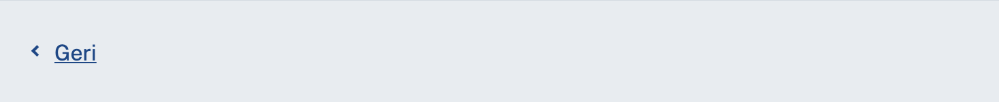 | **Geri bağlantısı**<br><sub>Back link</sub> | kararlı | — | kararlı | [Belge](https://trds.chele.bi/bilesenler/back-link.html) |
|  | **Hizmet gezinmesi**<br><sub>Service navigation</sub> | kararlı | — | kararlı | [Belge](https://trds.chele.bi/bilesenler/service-navigation.html) |
|  | **İçeriğe atlama bağlantısı**<br><sub>Skip link</sub> | kararlı | — | kararlı | [Belge](https://trds.chele.bi/bilesenler/skip-link.html) |
| 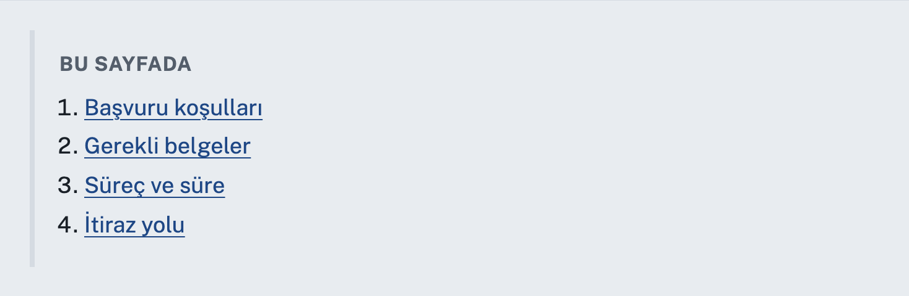 | **Sayfa içi gezinme**<br><sub>In-page navigation</sub> | kararlı | — | kararlı | [Belge](https://trds.chele.bi/bilesenler/in-page-navigation.html) |
| 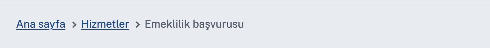 | **Sayfa yolu**<br><sub>Breadcrumb</sub> | kararlı | — | kararlı | [Belge](https://trds.chele.bi/bilesenler/breadcrumb.html) |
| 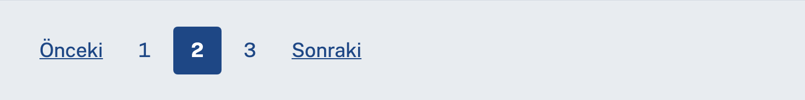 | **Sayfalama**<br><sub>Pagination</sub> | kararlı | — | kararlı | [Belge](https://trds.chele.bi/bilesenler/pagination.html) |
| 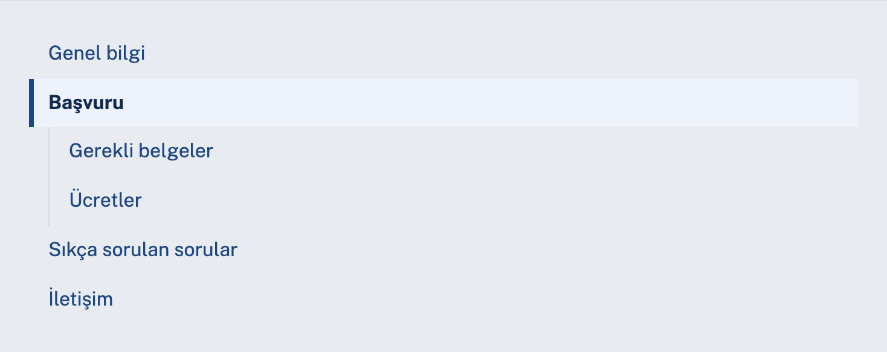 | **Yan menü**<br><sub>Side navigation</sub> | kararlı | — | kararlı | [Belge](https://trds.chele.bi/bilesenler/side-navigation.html) |

### Form

Kullanıcıdan bilgi alan parçalar.

| Görünüm | Bileşen | CSS | JS | React | |
|---|---|---|---|---|---|
| 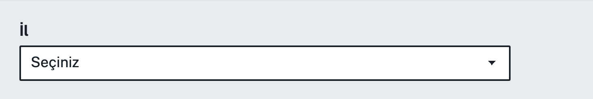 | **Açılır liste**<br><sub>Select</sub> | kararlı | — | kararlı | [Belge](https://trds.chele.bi/bilesenler/select.html) |
| 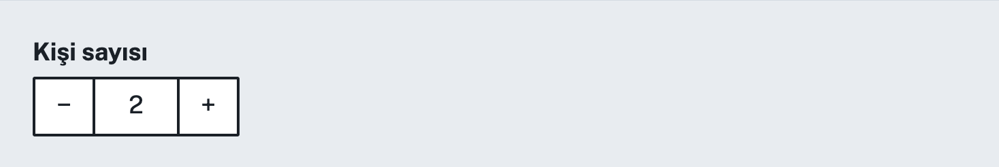 | **Adet seçici**<br><sub>Quantity stepper</sub> | kararlı | artır, azalt | kararlı | [Belge](https://trds.chele.bi/bilesenler/quantity.html) |
| 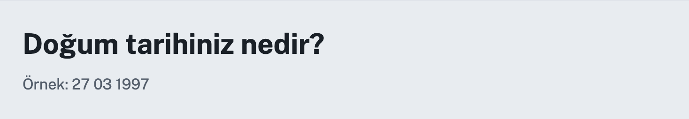 | **Alan grubu**<br><sub>Fieldset</sub> | kararlı | — | kararlı | [Belge](https://trds.chele.bi/bilesenler/fieldset.html) |
| 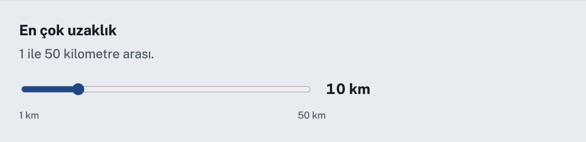 | **Aralık seçici**<br><sub>Range slider</sub> | kararlı | değer gösterimi | kararlı | [Belge](https://trds.chele.bi/bilesenler/range.html) |
| 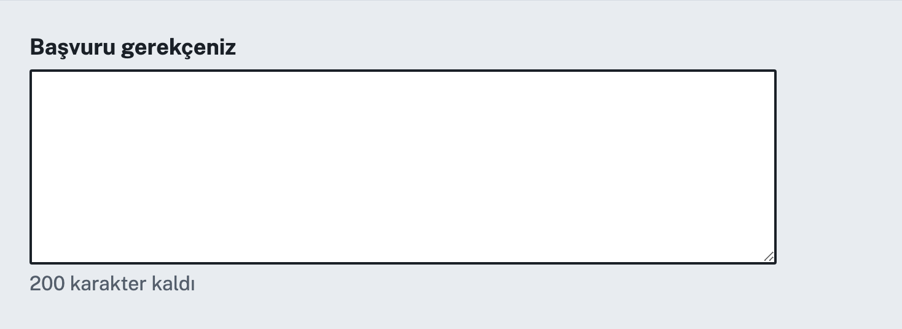 | **Çok satırlı metin**<br><sub>Textarea</sub> | kararlı | karakter sayacı | kararlı | [Belge](https://trds.chele.bi/bilesenler/textarea.html) |
| 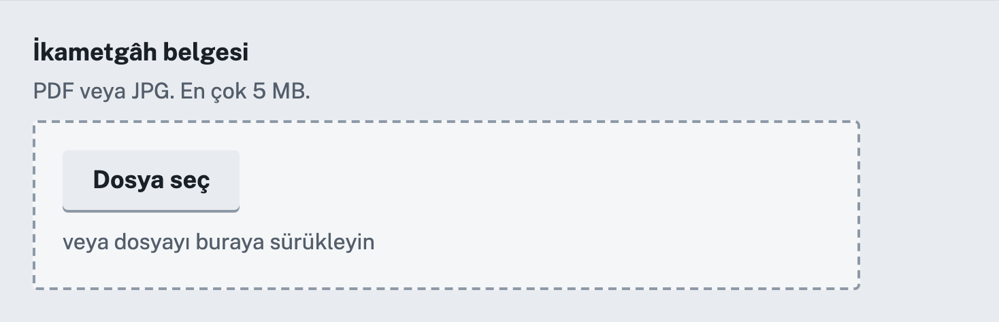 | **Dosya yükleme**<br><sub>File upload</sub> | kararlı | sürükle, listele, kaldır | kararlı | [Belge](https://trds.chele.bi/bilesenler/file-upload.html) |
| 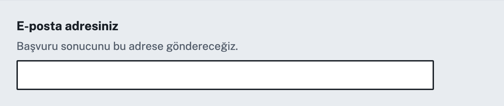 | **E-posta girişi**<br><sub>Email input</sub> | kararlı | — | kararlı | [Belge](https://trds.chele.bi/bilesenler/email-input.html) |
| 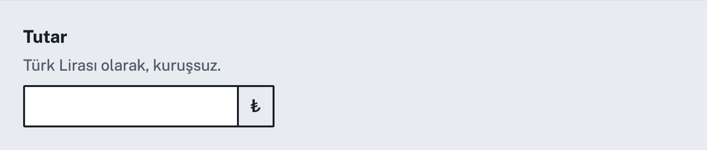 | **Girdi grubu**<br><sub>Input group</sub> | kararlı | — | kararlı | [Belge](https://trds.chele.bi/bilesenler/input-group.html) |
| 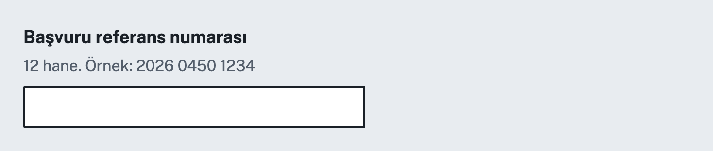 | **Girdi maskesi**<br><sub>Input mask</sub> | kararlı | biçimlendirme | kararlı | [Belge](https://trds.chele.bi/bilesenler/input-mask.html) |
| 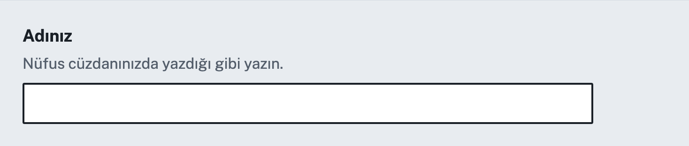 | **Metin girişi**<br><sub>Text input</sub> | kararlı | — | kararlı | [Belge](https://trds.chele.bi/bilesenler/text-input.html) |
| 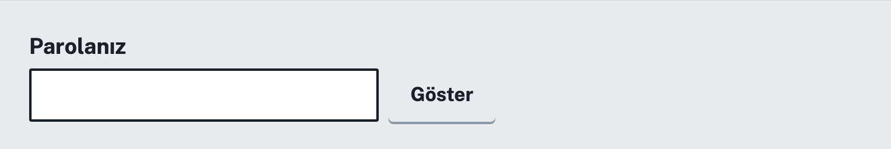 | **Parola girişi**<br><sub>Password input</sub> | kararlı | göster ve gizle | kararlı | [Belge](https://trds.chele.bi/bilesenler/password-input.html) |
| 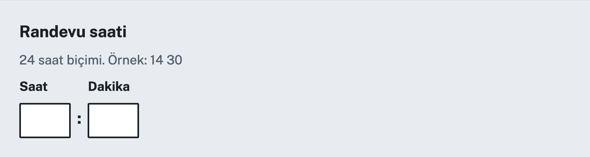 | **Saat girişi**<br><sub>Time input</sub> | kararlı | — | kararlı | [Belge](https://trds.chele.bi/bilesenler/time-input.html) |
| 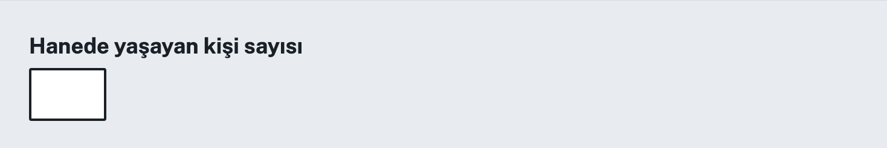 | **Sayı girişi**<br><sub>Number input</sub> | kararlı | — | kararlı | [Belge](https://trds.chele.bi/bilesenler/number-input.html) |
| 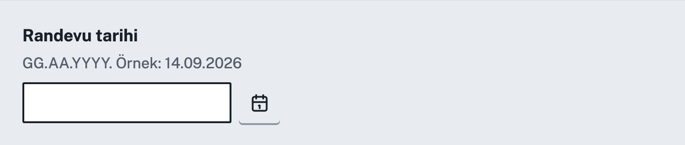 | **Takvim**<br><sub>Date picker</sub> | kararlı | ay ızgarası ve klavye | kararlı | [Belge](https://trds.chele.bi/bilesenler/date-picker.html) |
| 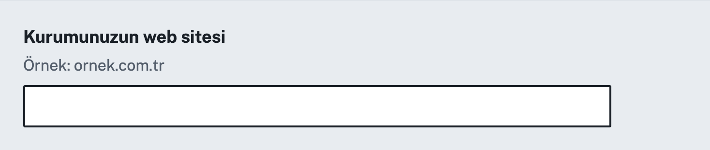 | **Web adresi girişi**<br><sub>URL input</sub> | kararlı | — | kararlı | [Belge](https://trds.chele.bi/bilesenler/url-input.html) |
| 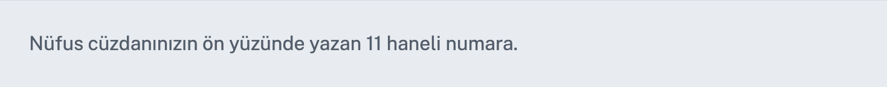 | **Yardım metni**<br><sub>Hint</sub> | kararlı | — | kararlı | [Belge](https://trds.chele.bi/bilesenler/hint.html) |

### Seçim

Kullanıcının seçenekler arasından seçim yapmasını sağlayan parçalar.

| Görünüm | Bileşen | CSS | JS | React | |
|---|---|---|---|---|---|
| 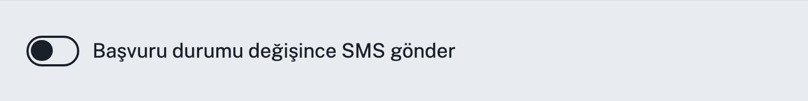 | **Anahtar**<br><sub>Switch</sub> | kararlı | — | kararlı | [Belge](https://trds.chele.bi/bilesenler/switch.html) |
| 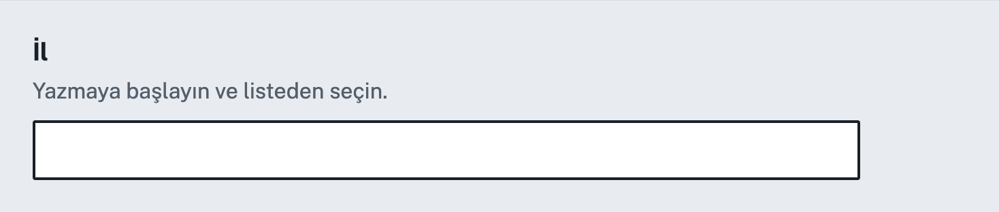 | **Aranabilir liste**<br><sub>Combobox</sub> | kararlı | süzme ve klavye | kararlı | [Belge](https://trds.chele.bi/bilesenler/combobox.html) |
| 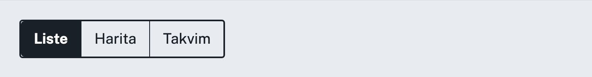 | **Bölümlü seçim**<br><sub>Segmented control</sub> | kararlı | — | kararlı | [Belge](https://trds.chele.bi/bilesenler/segmented-control.html) |
| 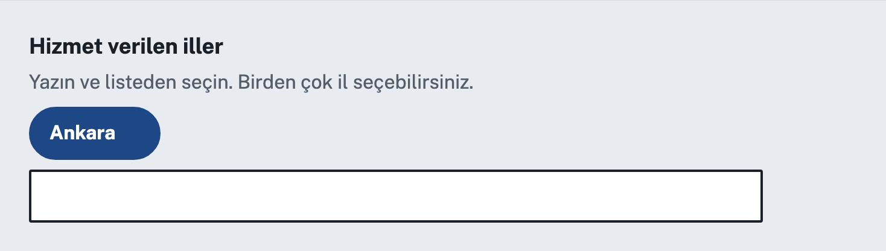 | **Çoklu seçim**<br><sub>Multi-select</sub> | kararlı | süzme, seçim etiketi | kararlı | [Belge](https://trds.chele.bi/bilesenler/multi-select.html) |
| 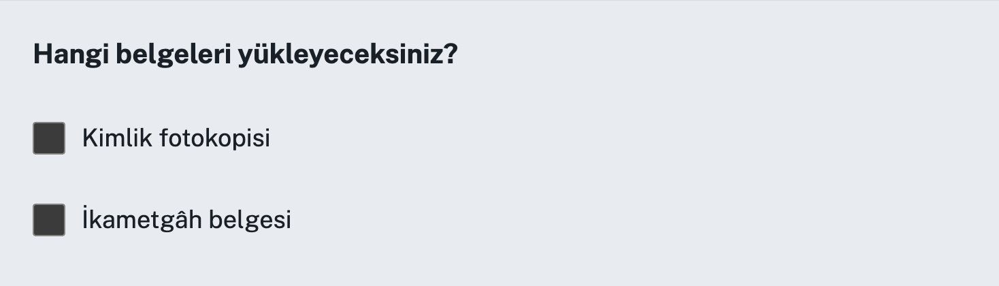 | **Onay kutusu**<br><sub>Checkbox</sub> | kararlı | — | kararlı | [Belge](https://trds.chele.bi/bilesenler/checkbox.html) |
| 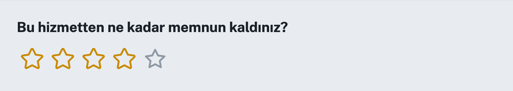 | **Puanlama**<br><sub>Rating</sub> | kararlı | — | kararlı | [Belge](https://trds.chele.bi/bilesenler/rating.html) |
| 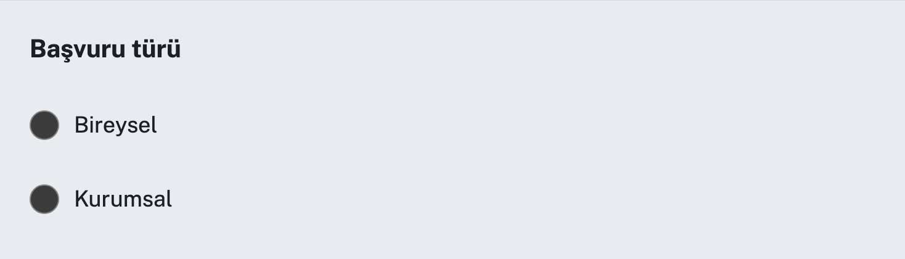 | **Seçenek düğmesi**<br><sub>Radio</sub> | kararlı | — | kararlı | [Belge](https://trds.chele.bi/bilesenler/radio.html) |
| 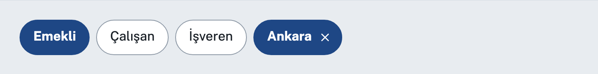 | **Seçim etiketi**<br><sub>Chip</sub> | kararlı | kaldırma | kararlı | [Belge](https://trds.chele.bi/bilesenler/chip.html) |

### Eylem

Kullanıcının bir işlem başlatmasını sağlayan parçalar.

| Görünüm | Bileşen | CSS | JS | React | |
|---|---|---|---|---|---|
| 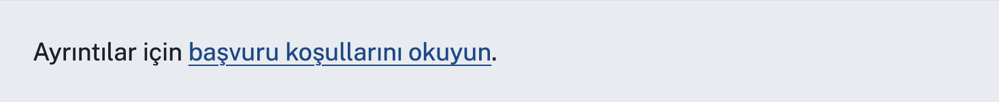 | **Bağlantı**<br><sub>Link</sub> | kararlı | — | kararlı | [Belge](https://trds.chele.bi/bilesenler/link.html) |
| 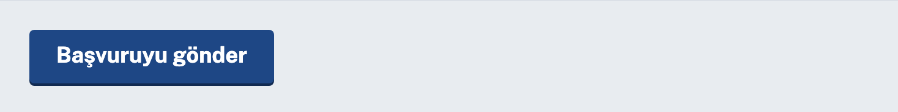 | **Düğme**<br><sub>Button</sub> | kararlı | — | kararlı | [Belge](https://trds.chele.bi/bilesenler/button.html) |
| 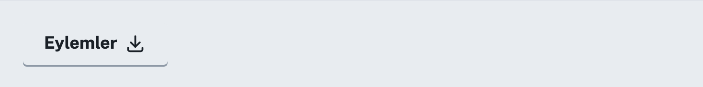 | **Eylem menüsü**<br><sub>Action menu</sub> | kararlı | klavye desteği | kararlı | [Belge](https://trds.chele.bi/bilesenler/action-menu.html) |
| 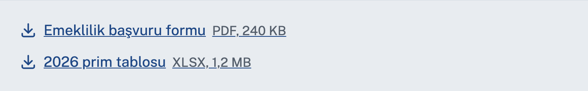 | **İndirme bağlantısı**<br><sub>Download link</sub> | kararlı | — | kararlı | [Belge](https://trds.chele.bi/bilesenler/download-link.html) |
| 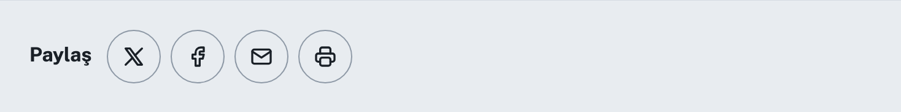 | **Paylaş**<br><sub>Share</sub> | kararlı | — | kararlı | [Belge](https://trds.chele.bi/bilesenler/share.html) |
| 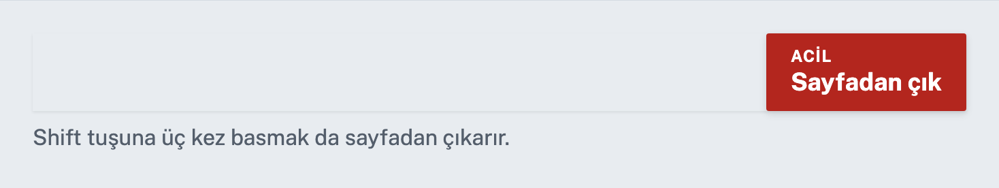 | **Sayfadan çık**<br><sub>Exit this page</sub> | kararlı | hızlı çıkış | kararlı | [Belge](https://trds.chele.bi/bilesenler/exit-this-page.html) |
| 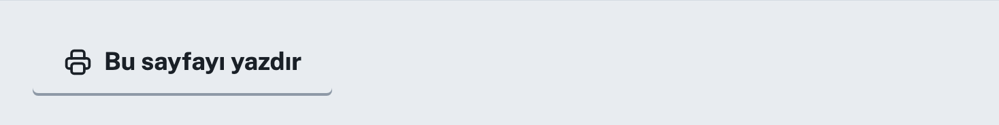 | **Yazdır**<br><sub>Print button</sub> | kararlı | yazdırma | kararlı | [Belge](https://trds.chele.bi/bilesenler/print.html) |
| 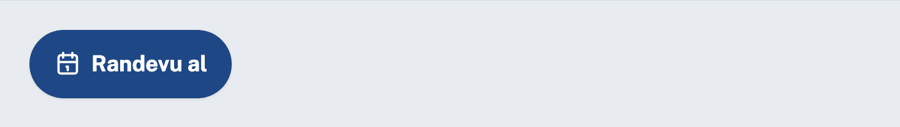 | **Yüzen düğme**<br><sub>Floating action button</sub> | kararlı | — | kararlı | [Belge](https://trds.chele.bi/bilesenler/fab.html) |

### Geri bildirim

Sistemin kullanıcıya durum bildiren parçaları.

| Görünüm | Bileşen | CSS | JS | React | |
|---|---|---|---|---|---|
|  | **Açılır bilgi**<br><sub>Popover</sub> | kararlı | aç ve kapat | kararlı | [Belge](https://trds.chele.bi/bilesenler/popover.html) |
|  | **Bildirim afişi**<br><sub>Notification banner</sub> | kararlı | — | kararlı | [Belge](https://trds.chele.bi/bilesenler/notification-banner.html) |
|  | **Geçici bildirim**<br><sub>Toast</sub> | kararlı | kapatma ve süre | kararlı | [Belge](https://trds.chele.bi/bilesenler/toast.html) |
|  | **Hata mesajı**<br><sub>Error message</sub> | kararlı | — | kararlı | [Belge](https://trds.chele.bi/bilesenler/error-message.html) |
|  | **Hata özeti**<br><sub>Error summary</sub> | kararlı | odak yönetimi | kararlı | [Belge](https://trds.chele.bi/bilesenler/error-summary.html) |
|  | **İlerleme çubuğu**<br><sub>Progress</sub> | kararlı | — | kararlı | [Belge](https://trds.chele.bi/bilesenler/progress.html) |
|  | **İpucu**<br><sub>Tooltip</sub> | kararlı | göster ve gizle | kararlı | [Belge](https://trds.chele.bi/bilesenler/tooltip.html) |
|  | **İskelet**<br><sub>Skeleton</sub> | kararlı | — | kararlı | [Belge](https://trds.chele.bi/bilesenler/skeleton.html) |
|  | **Sonuç paneli**<br><sub>Panel</sub> | kararlı | — | kararlı | [Belge](https://trds.chele.bi/bilesenler/panel.html) |
|  | **Uyarı**<br><sub>Alert</sub> | kararlı | — | kararlı | [Belge](https://trds.chele.bi/bilesenler/alert.html) |
|  | **Uyarı metni**<br><sub>Warning text</sub> | kararlı | — | kararlı | [Belge](https://trds.chele.bi/bilesenler/warning-text.html) |
|  | **Yönlendirme**<br><sub>Coach mark</sub> | kararlı | adımlar | kararlı | [Belge](https://trds.chele.bi/bilesenler/coach-mark.html) |
|  | **Yükleniyor**<br><sub>Spinner</sub> | kararlı | — | kararlı | [Belge](https://trds.chele.bi/bilesenler/spinner.html) |

### Yerleşim

İçeriği düzenleyen ve gruplayan parçalar.

| Görünüm | Bileşen | CSS | JS | React | |
|---|---|---|---|---|---|
|  | **Akordiyon**<br><sub>Accordion</sub> | kararlı | aç ve kapat | kararlı | [Belge](https://trds.chele.bi/bilesenler/accordion.html) |
|  | **Ayraç**<br><sub>Divider</sub> | kararlı | — | kararlı | [Belge](https://trds.chele.bi/bilesenler/divider.html) |
|  | **Ayrıntılar**<br><sub>Details</sub> | kararlı | — | kararlı | [Belge](https://trds.chele.bi/bilesenler/details.html) |
|  | **Bölüm**<br><sub>Section</sub> | kararlı | — | kararlı | [Belge](https://trds.chele.bi/bilesenler/section.html) |
|  | **Izgara**<br><sub>Grid</sub> | kararlı | — | kararlı | [Belge](https://trds.chele.bi/bilesenler/grid.html) |
|  | **Kap**<br><sub>Container</sub> | kararlı | — | kararlı | [Belge](https://trds.chele.bi/bilesenler/container.html) |
|  | **Karo**<br><sub>Tile</sub> | kararlı | — | kararlı | [Belge](https://trds.chele.bi/bilesenler/tile.html) |
|  | **Karşılama bloğu**<br><sub>Hero</sub> | kararlı | — | kararlı | [Belge](https://trds.chele.bi/bilesenler/hero.html) |
|  | **Kart**<br><sub>Card</sub> | kararlı | — | kararlı | [Belge](https://trds.chele.bi/bilesenler/card.html) |
|  | **Kayan pano**<br><sub>Carousel</sub> | kararlı | düğmeler ve noktalar | kararlı | [Belge](https://trds.chele.bi/bilesenler/carousel.html) |
|  | **Kip pencere**<br><sub>Modal</sub> | kararlı | odak tuzağı | kararlı | [Belge](https://trds.chele.bi/bilesenler/modal.html) |
|  | **Sekmeler**<br><sub>Tabs</sub> | kararlı | klavye desteği | kararlı | [Belge](https://trds.chele.bi/bilesenler/tabs.html) |
|  | **Simge kartı**<br><sub>Icon card</sub> | kararlı | — | kararlı | [Belge](https://trds.chele.bi/bilesenler/icon-card.html) |
|  | **Yan panel**<br><sub>Drawer</sub> | kararlı | aç ve kapat | kararlı | [Belge](https://trds.chele.bi/bilesenler/drawer.html) |
|  | **Yardımcı sınıflar**<br><sub>Utility classes</sub> | kararlı | — | — | [Belge](https://trds.chele.bi/bilesenler/utilities.html) |

### İçerik

Veriyi ve metni sunan parçalar.

| Görünüm | Bileşen | CSS | JS | React | |
|---|---|---|---|---|---|
|  | **Alıntı**<br><sub>Blockquote</sub> | kararlı | — | kararlı | [Belge](https://trds.chele.bi/bilesenler/blockquote.html) |
|  | **Avatar**<br><sub>Avatar</sub> | kararlı | — | kararlı | [Belge](https://trds.chele.bi/bilesenler/avatar.html) |
|  | **Bilgi kutusu**<br><sub>Callout</sub> | kararlı | — | kararlı | [Belge](https://trds.chele.bi/bilesenler/callout.html) |
|  | **Etiket**<br><sub>Tag</sub> | kararlı | — | kararlı | [Belge](https://trds.chele.bi/bilesenler/tag.html) |
|  | **Görev listesi**<br><sub>Task list</sub> | kararlı | — | kararlı | [Belge](https://trds.chele.bi/bilesenler/task-list.html) |
|  | **Görsel**<br><sub>Figure</sub> | kararlı | — | kararlı | [Belge](https://trds.chele.bi/bilesenler/figure.html) |
|  | **İstatistik kutusu**<br><sub>Stat tile</sub> | kararlı | — | kararlı | [Belge](https://trds.chele.bi/bilesenler/stat.html) |
|  | **Kayıt listesi**<br><sub>Collection</sub> | kararlı | — | kararlı | [Belge](https://trds.chele.bi/bilesenler/collection.html) |
|  | **Kod**<br><sub>Code</sub> | kararlı | — | kararlı | [Belge](https://trds.chele.bi/bilesenler/code.html) |
|  | **Liste**<br><sub>List</sub> | kararlı | — | kararlı | [Belge](https://trds.chele.bi/bilesenler/list.html) |
|  | **Özet listesi**<br><sub>Summary list</sub> | kararlı | — | kararlı | [Belge](https://trds.chele.bi/bilesenler/summary-list.html) |
|  | **Rozet**<br><sub>Badge</sub> | kararlı | — | kararlı | [Belge](https://trds.chele.bi/bilesenler/badge.html) |
|  | **Ses**<br><sub>Audio</sub> | kararlı | — | kararlı | [Belge](https://trds.chele.bi/bilesenler/audio.html) |
|  | **Sıralanabilir tablo**<br><sub>Sortable table</sub> | kararlı | sütun sıralama | kararlı | [Belge](https://trds.chele.bi/bilesenler/sortable-table.html) |
|  | **Simge**<br><sub>Icon</sub> | kararlı | — | kararlı | [Belge](https://trds.chele.bi/bilesenler/icon.html) |
|  | **Simgeli liste**<br><sub>Icon list</sub> | kararlı | — | kararlı | [Belge](https://trds.chele.bi/bilesenler/icon-list.html) |
|  | **Son güncelleme**<br><sub>Date modified</sub> | kararlı | — | kararlı | [Belge](https://trds.chele.bi/bilesenler/date-modified.html) |
|  | **Süreç listesi**<br><sub>Process list</sub> | kararlı | — | kararlı | [Belge](https://trds.chele.bi/bilesenler/process-list.html) |
|  | **Tablo**<br><sub>Table</sub> | kararlı | — | kararlı | [Belge](https://trds.chele.bi/bilesenler/table.html) |
|  | **Takip et**<br><sub>Follow</sub> | kararlı | — | kararlı | [Belge](https://trds.chele.bi/bilesenler/follow.html) |
|  | **Tanım listesi**<br><sub>Description list</sub> | kararlı | — | kararlı | [Belge](https://trds.chele.bi/bilesenler/description-list.html) |
|  | **Tipografi**<br><sub>Typography</sub> | kararlı | — | kararlı | [Belge](https://trds.chele.bi/bilesenler/typography.html) |
|  | **Video**<br><sub>Video</sub> | kararlı | — | kararlı | [Belge](https://trds.chele.bi/bilesenler/video.html) |
|  | **Vurgulu metin**<br><sub>Inset text</sub> | kararlı | — | kararlı | [Belge](https://trds.chele.bi/bilesenler/inset-text.html) |
|  | **Zaman çizelgesi**<br><sub>Timeline</sub> | kararlı | — | kararlı | [Belge](https://trds.chele.bi/bilesenler/timeline.html) |

### Türkiye’ye özgü form

Türk kimlik, adres ve finans biçimlerini alan parçalar.

| Görünüm | Bileşen | CSS | JS | React | |
|---|---|---|---|---|---|
|  | 🇹🇷 **Adres**<br><sub>Address</sub> | kararlı | bağlı listeler | kararlı | [Belge](https://trds.chele.bi/bilesenler/adres.html) |
|  | 🇹🇷 **IBAN girişi**<br><sub>IBAN input</sub> | kararlı | doğrulama | kararlı | [Belge](https://trds.chele.bi/bilesenler/iban-girisi.html) |
|  | 🇹🇷 **Plaka girişi**<br><sub>Licence plate input</sub> | kararlı | biçimlendirme | kararlı | [Belge](https://trds.chele.bi/bilesenler/plaka-girisi.html) |
|  | 🇹🇷 **T.C. kimlik numarası girişi**<br><sub>National identity number input</sub> | kararlı | doğrulama | kararlı | [Belge](https://trds.chele.bi/bilesenler/kimlik-no.html) |
|  | 🇹🇷 **Tarih girişi**<br><sub>Date input</sub> | kararlı | doğrulama | kararlı | [Belge](https://trds.chele.bi/bilesenler/tarih-girisi.html) |
|  | 🇹🇷 **Telefon girişi**<br><sub>Phone input</sub> | kararlı | biçimlendirme | kararlı | [Belge](https://trds.chele.bi/bilesenler/telefon-girisi.html) |
|  | 🇹🇷 **Vergi kimlik numarası girişi**<br><sub>Tax number input</sub> | kararlı | doğrulama | kararlı | [Belge](https://trds.chele.bi/bilesenler/vergi-no.html) |

### Türkiye’ye özgü hizmet

Türk mevzuatından ve altyapısından doğan parçalar.

| Görünüm | Bileşen | CSS | JS | React | |
|---|---|---|---|---|---|
|  | 🇹🇷 **e-Devlet ile giriş**<br><sub>e-Devlet sign in</sub> | kararlı | — | kararlı | [Belge](https://trds.chele.bi/bilesenler/edevlet-giris.html) |
|  | 🇹🇷 **Erişilebilirlik menüsü**<br><sub>Accessibility menu</sub> | kararlı | ayar saklama | kararlı | [Belge](https://trds.chele.bi/bilesenler/erisim-menusu.html) |
|  | 🇹🇷 **KVKK açık rıza**<br><sub>Data protection consent</sub> | kararlı | gönderim denetimi | kararlı | [Belge](https://trds.chele.bi/bilesenler/kvkk-onay.html) |

<!-- BILESEN:BITIR -->

## Entegrasyonlar

<!-- ENTEGRASYON:BASLA -->
<!-- Bu blok üretilir. Elle değiştirmeyin: node tools/readme.mjs -->

| Teknoloji | Paket | Durum | Kurulum |
|---|---|---|---|
| Düz HTML ve CSS | `@kiris-ds/core` | kararlı | `npm install @kiris-ds/core` |
| React | `@kiris-ds/react` | kararlı | `npm install @kiris-ds/react @kiris-ds/core` |
| Next.js | `@kiris-ds/react` | beta | `npm install @kiris-ds/react @kiris-ds/core` |
| Vue | `@kiris-ds/vue` | kararlı | `npm install @kiris-ds/vue @kiris-ds/core` |
| Angular | `@kiris-ds/core` | beta | `npm install @kiris-ds/core` |
| ASP.NET Core | `@kiris-ds/core` | değerlendiriliyor | `CSS ve JS dosyalarını wwwroot altına kopyalayın.` |
| Java ve Thymeleaf | `@kiris-ds/core` | değerlendiriliyor | `CSS ve JS dosyalarını static klasörüne kopyalayın.` |

<!-- ENTEGRASYON:BITIR -->

## Lisans ikiye ayrılır

| Paket | Lisans | Kim kullanabilir |
|---|---|---|
| `@kiris-ds/core` | MIT | Herkes |
| `@kiris-ds/tokens` | MIT | Herkes |
| `@kiris-ds/validators` | MIT | Herkes |
| `@kiris-ds/react` | MIT | Herkes |
| `@kiris-ds/vue`, `@kiris-ds/tanim` | MIT | Herkes |
| `@kiris-ds/theme-*` | MIT | Herkes |
| `@kiris-ds/identity` simgeleri | MIT (Tabler Icons) | Herkes |
| `@kiris-ds/identity` devlet kimliği | Ayrı koşullar | Hak sahibinin izni gerekir |

Kod herkese açıktır, böylece tedarikçi, üniversite ve belediye izin istemeden
kullanır. Devlet kimliği kısıtlıdır, böylece sahte site kuranlar resmî görünmek
için hazır bir araç bulamaz. Bu ayrım Fransa (DSFR) ve İrlanda (GOV.IE)
uygulamalarından alındı.

Ayrıntı: [LICENSE](./LICENSE) ve [LICENSE-IDENTITY.md](./LICENSE-IDENTITY.md).

## Katkı

Bu açık bir depodur, açık bir karar organı değildir. Önce
[CONTRIBUTING.md](./CONTRIBUTING.md) ve [GOVERNANCE.md](./GOVERNANCE.md)
dosyalarını okuyun.

Bir bileşen beş ölçütü karşılamadan sisteme girmez: **yararlı, benzersiz,
kullanılabilir, tutarlı, çok yönlü.** Ölçütler Birleşik Krallık tasarım
sisteminden alındı. Yaşam döngüsü Hollanda bayrak yarışı modelinden alındı.

## Kaynaklar

Bu sistem on beş ulusal tasarım sistemi okunarak tasarlandı. En çok
yararlanılanlar:

| Ne alındı | Kaynak |
|---|---|
| Katkı ölçütleri, tip ölçeği, odak halkası | [GOV.UK Design System](https://design-system.service.gov.uk/) |
| Belirteç ve yardımcı sınıf ayrımı, olgunluk modeli | [USWDS](https://designsystem.digital.gov/) |
| Bayrak yarışı yaşam döngüsü, tamamlanma tanımı | [NL Design System](https://nldesignsystem.nl/) |
| Renk adlandırma kuralı, temadan tema üretimi | [Designsystemet, Norveç](https://designsystemet.no/) |
| Teknolojiye göre bileşen durumu | [GOV.IE Design System](https://ds.services.gov.ie/) |
| Kısıtlı kimlik lisansı | [DSFR, Fransa](https://www.systeme-de-design.gouv.fr/) |
| İki tema, vatandaş ve işletme | [DKFDS, Danimarka](https://designsystem.dk/) |
| Resmî site afişi, erişilebilirlik bileşenleri | [KRDS, Kore](https://www.krds.go.kr/) |
| Belirteç boru hattı | [Digital Agency, Japonya](https://design.digital.go.jp/) |
